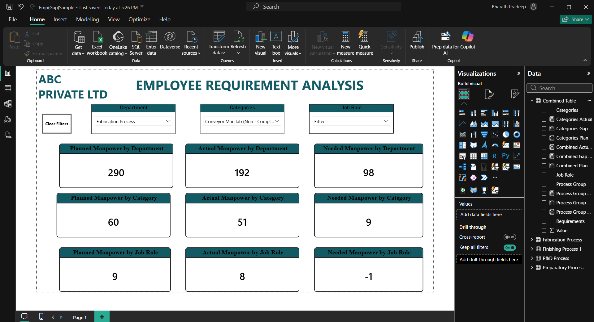

# Manpower Requirement Analysis Dashboard

## Project Overview

The **Manpower Requirement Analysis Dashboard** is an interactive **Power BI dashboard** developed to analyze manpower requirements across different operational processes and workforce categories.

The dashboard helps compare workforce requirements, analyze manpower distribution, and identify staffing gaps to support better manpower planning and decision-making.

## Dashboard Preview



## Objectives

* Analyze manpower requirements across different processes.
* Compare planned and actual manpower.
* Identify manpower shortages and excess workforce.
* Analyze workforce requirements by role and category.
* Monitor employee-related KPIs.
* Provide interactive workforce insights for better planning and decision-making.

## Key KPIs

The dashboard includes the following key performance indicators:

* **Total Employees**
* **Employees Total Days**
* **Total Manhours**
* **Invoice Amount**

## Processes Analyzed

The dashboard analyzes manpower requirements across multiple operational processes:

* Fabrication
* Finishing
* Preparatory
* P&D

## Workforce Categories

The analysis includes different workforce categories and roles such as:

* Fitter
* Semi Fitter
* Welder
* Helper
* Painter
* Operator
* Other relevant workforce categories

## Key Dashboard Features

* Interactive KPI cards
* Planned vs Actual manpower analysis
* Manpower gap analysis
* Process-wise manpower analysis
* Role-wise manpower analysis
* Interactive slicers and filters
* Dynamic Power BI visuals
* Workforce requirement analysis
* Business-focused dashboard design

## DAX Measures

DAX was used to create calculated measures and KPIs for dynamic analysis.

### 1. Total Employees

```DAX
Total Employees =
DISTINCTCOUNT('Master'[Employee ID])
```

This measure calculates the unique number of employees in the dataset.

### 2. Manpower Gap

```DAX
Manpower Gap =
[Planned Manpower] - [Actual Manpower]
```

This measure calculates the difference between planned manpower and actual manpower.

### 3. Manpower Achievement %

```DAX
Manpower Achievement % =
DIVIDE(
    [Actual Manpower],
    [Planned Manpower],
    0
)
```

This measure calculates the percentage of actual manpower against the planned manpower requirement.

> **Note:** The DAX examples above represent the type of calculations used in the dashboard. If your actual measure/table names differ, use the exact names from your Power BI model.

## Tools & Technologies

| Tool                | Purpose                                      |
| ------------------- | -------------------------------------------- |
| **Power BI**        | Dashboard development and data visualization |
| **Power Query**     | Data cleaning and transformation             |
| **DAX**             | Calculated measures and KPI analysis         |
| **Microsoft Excel** | Source data and data preparation             |

## Data Preparation

The project follows a data preparation and visualization workflow:

```text
Excel Dataset
      ↓
Power Query
      ↓
Data Cleaning & Transformation
      ↓
Data Modeling
      ↓
DAX Measures
      ↓
Power BI Visualizations
      ↓
Interactive Dashboard
```

## Analysis Performed

### Planned vs Actual Manpower

The dashboard compares planned manpower requirements with actual workforce availability to identify workforce differences.

### Manpower Gap Analysis

The dashboard helps identify areas where actual manpower is below or above the planned requirement.

### Process-wise Analysis

Manpower requirements can be analyzed across Fabrication, Finishing, Preparatory, and P&D processes.

### Role-wise Analysis

Workforce requirements can be analyzed across different job roles and manpower categories.

## Key Insights

The dashboard can help users:

* Identify manpower shortages.
* Compare planned and actual workforce.
* Determine roles requiring additional manpower.
* Analyze manpower distribution across processes.
* Monitor workforce requirements.
* Support manpower allocation and planning decisions.

## Project Structure

```text
manpower-requirement-analysis-powerbi/
│
├── Emp(Gap)Sample.pbix
│    
│
├── dashboard.png
│   
│
└── README.md
```

## Project Files

### Power BI Dashboard

`Emp(Gap)Sample.pbix`

Contains the Power BI data model, transformations, DAX calculations, and interactive dashboard.

### Dashboard Screenshot

`Dashboard.png`

Contains a preview of the completed Power BI dashboard displayed above.

## Dataset

The project uses Excel-based manpower requirement data covering multiple operational processes.

If the original dataset contains confidential company or internship information, it should **not be uploaded to a public GitHub repository**. A sample or anonymized dataset can be used instead.

## Skills Demonstrated

* Power BI Dashboard Development
* Data Visualization
* Data Cleaning
* Data Transformation
* Data Modeling
* Power Query
* DAX
* Microsoft Excel
* KPI Development
* Business Analysis
* Manpower Analysis

## Author

**Bharath Pradeep A**

**B.Sc Computer Science with Data Analytics**

### Technical Skills

`Power BI` · `Power Query` · `DAX` · `Excel` · `Python` · `SQL` · `Data Analytics`


